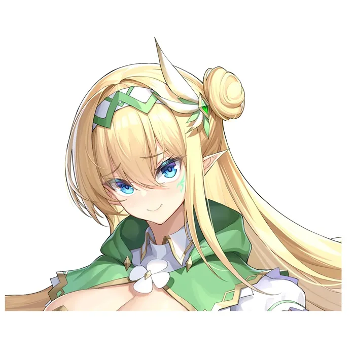
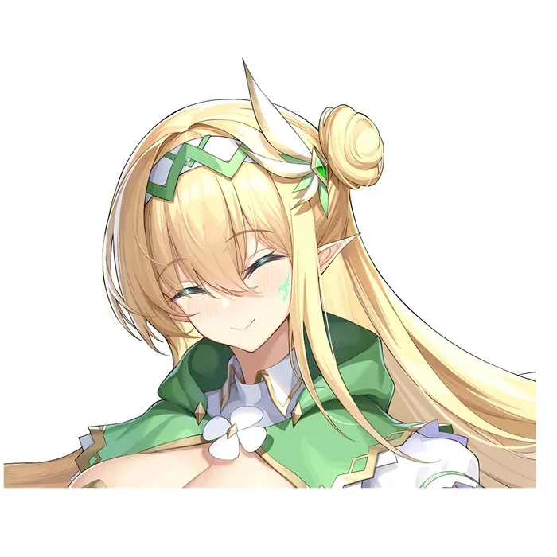

# 人设章·安娜塔西雅

姓名：安娜塔西雅

种族：精灵

角色介绍：成熟稳重，既有女仆的温柔和包容性，也有身为战士的严肃与果决。血缘关系上是菲娅的姐姐，但二人同母异父，所以身上没有王族的血脉。幼年时因为父辈间的孽缘，被精灵国王刻上罪人印记后流放，后被菲娅找回，成为保护菲娅安全，照顾菲娅衣食起居的专属女仆。

由于流放后被找回的经历，所以安娜塔西雅将救回她的菲娅当成生命里的太阳，可以为了菲娅做任何事。对敌人毫不手软，但不会轻易把敌意表露出来，属于智慧而杀伐果决的类型。

在照顾精灵公主的衣食起居上，相当有女仆的矜持与能干。

ps：由于不可描述的感情，夜里偶尔会控制不住地......

--------以下为表情--------

苦笑

难为情的样子

微笑的

平时一本正经的

注：这个画师因为找到正经工作所以跑路了，后面的莉提和米露只能换画师了_(:з」∠)_
